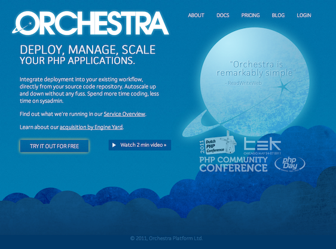

!SLIDE

# PHP outside the webserver #

PHP can run as a CGI, or, far better as FastCGI.

CGI launches an application for each requests.

FastCGI is a server, runs permanently with its owner, behind a TCP connection.

!SLIDE

# Fast CGI #

FastCGI is a standard. Apache talks FastCGI, but monothreaded servers too.

**Lighttpd** (Lighty) / **Nginx** (Engine X) / **Cherokee**

You can use different FastCGI servers behind a webserver.
Different applications, or different instances of a same application with different configurations.

FastCGI can run on a different computer, just like your Mysql.

!SLIDE

# PHP-FPM #

PHP-fpm was a Russian patch for php-cgi.

It is now a PHP 5.4 core feature.

IT IS STANDARD.

!SLIDE

# Where is my mod\_rewrite routing? #

You loose it. It's Apache specific.

Each webserver handles it differently. Even with `lua`.

Most of the time, someone clever gives you the config file, Nginx is no more exotic.

!SLIDE

# Delegate static file handling #

Sometimes you need some PHP logic (ACL, concatenating files …) then serving a static file.
If you are polite, you iterate over it, read and send parts.
Or you put it in memory then throw it.

Lighty built `X-sendfile` for that.
Nginx named it `X-Accel-Redirect` and there also a *mod\_xsendfile* for Apache.

The worker's job is done, it is now a webserver job, with `sendfile` optimization and rate limitation.

!SLIDE

# PHP-FPM uses recycling #

No more kleenex strategy. A PHP-worker is used 500 times.
It is a compromise between creation cost and memory leaks.

Crashed workers are recycled earlier.

!SLIDE

# PHP-FPM are monitored #

There is a slow log, like in Mysql.

The script file name and a stack trace are logged.

Now, good luck to find the context, most of PHP applications use a single entry point with routing.

!SLIDE

# I want my PECL modules #

Almost all PECL modules work.

APC cache is no pertinent anymore, but APC optimization is still useful.

XHProf and XDebug work very well.

!SLIDE

# The doom of /admin #

You keep your main pages light and fast.
But what about your admin pages with batch actions or "display all datas" ?

With Apache, you have to set memory and time bound for the worst case.

Like 1024 Mo and 30 minutes for an intranet. Elegant.

!SLIDE

# Chirurgical strike #

You can use different pools of connection with php-fpm. One pool per port.
The webserver dispatch with url pattern to the right port.

Each pool has its own configuration and user.

!SLIDE

# Scaling up and down #

You can use lots of workers and lots of servers for a huge website.

You can use 2 workers in a small virtualized slice or a plugserver.

Both work.

!SLIDE

# Please do not do batch in a webserver #

Use batch queue and php-cli.

wget in a cron file. Anyone already did that ?

!SLIDE

# PHP as a service #

Adding and removing workers is a cloud job.

You can do it yourself with Amazon, Joyent …

You can share a multi hosted frontend, and dispatch the load in the cloud.

Be careful with uploaded files.

Or you can use a PHP cloud hosting.

!SLIDE

# Orchestra.io #

!SLIDE

# The big ones #

Huge websites use Apache workers with specific webserver for static files.

Facebook use HipHop, compiling PHP to C++ then serving it through an event loop.

!SLIDE

# Beyond #

You don't need LAMP.

You need stable software stack to build your website.

Shared hosting is no more a curse, there is now light or virtualized hosting.

Use something that suit your needs. Even Apache.
